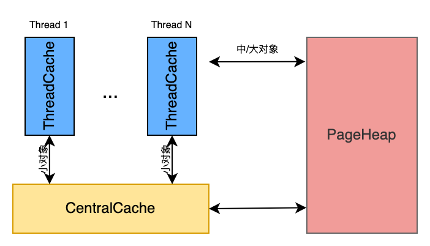
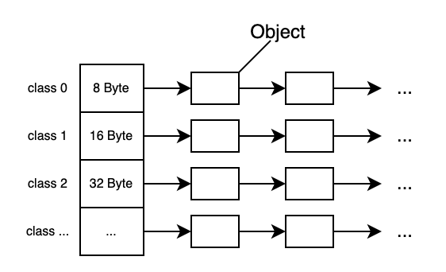
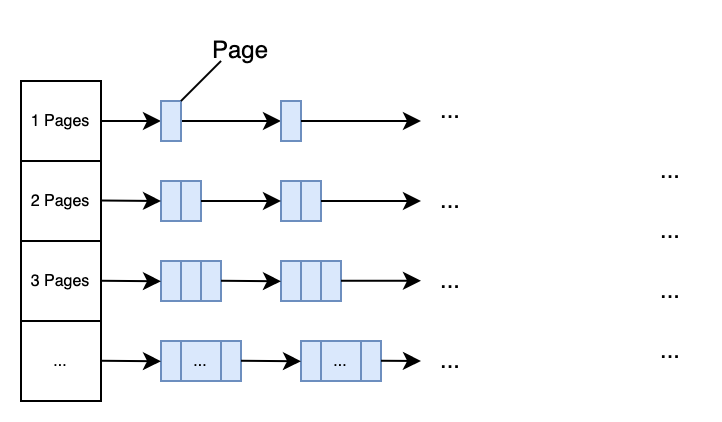
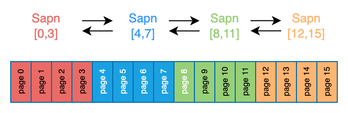
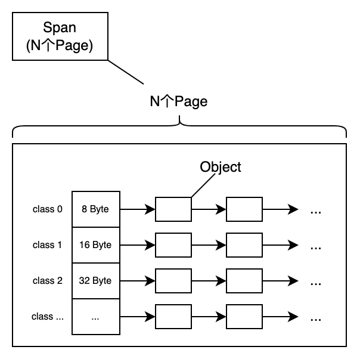
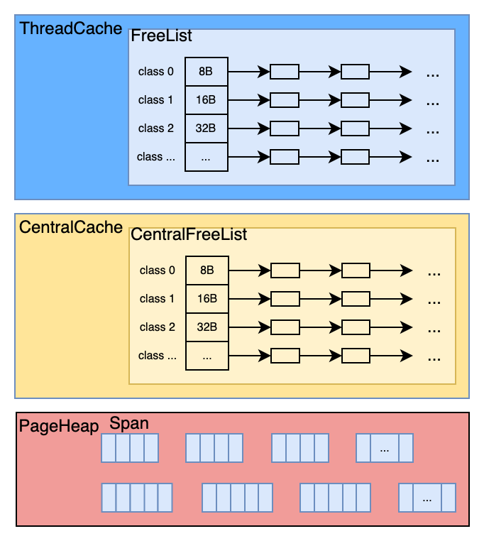
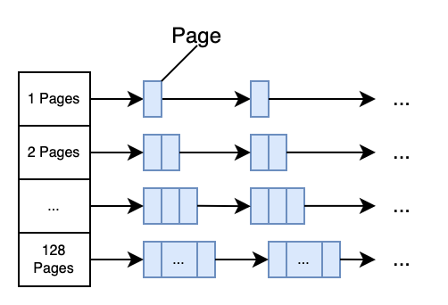

# 内存管理：TCMalloc

TCMalloc 是 Google 开发的内存分配器，在不少项目中都有使用，Go 中就使用了类似的算法进行内存分配。

本文对 TCMalloc 的设计和原理做一个整体的介绍和学习，主要是根据官方介绍作出的一些个人理解，难免有纰漏之处，不足的地方还请各位看官指正。

## 1. 概述

TCMalloc为每个线程Thread预分配一块线程本地缓存，称为`ThreadCache`,所有的小对象优先从`ThreadCache`中申请；在所有的`ThreadCache`外，还有一个共享的中心缓存区，叫做`CentralCache`，`CentralCache`所有线程共享。

当`ThreadCache`缓存不足时，线程就会从`CentralCache`获取；当`ThreadCache`缓存富裕或过多时，则将部分内存退还给`CentralCache`。由于`CentralCache`是所有线程共享的，所以访问一定需要加锁；而`ThreadCache`是线程独立的第一个交互内存，访问不需要加锁。

按照 TCMalloc 的设计，`ThreadCache`和`CentralCache`只是为了解决小对象的内存申请，但对于大块内存的申请则不经过这两者，而是线程直接向全局共享的内存堆`PageHeap`申请。

依据所占内存的大小，TCMalloc 将对象分为三类，如下表。

| 对象   | 大小范围      |
| ------ | ------------- |
| 小对象 | (0, 256KB]    |
| 中对象 | (256KB, 1MB]  |
| 大对象 | (1MB, 正无穷) |



## 2. TCMalloc中的基础单位

想要进一步了解 TCMalloc 的内部设计，首先需要了解 TCMalloc 中的基本名词Size-Class,Page,Span。

### 2.1 Size-Class

如前所述，每个小对象优先从`ThreadCache`中申请，那么为了衡量和表示小对象，TCMalloc 按大小将内存拆分为一个个可分配的单元，这些单元称为`size-class`。`size-class`的间隔是8 Byte, 16Byte, 32Byte,依次类似，总共88种不同大小的`size-class`.

最大间距会受到控制，这样当分配请求超过某个`size-class`时，可以直接四舍五入到下一级`size-class`，避免太多浪费。

`ThreadCache`包含各种`size-class`的单向链表，链表元素为自由可分配的对象。



注意：size-class的大小并不是完全的2的幂次方。因为这样也会存在的严重的浪费，具体值可以参见[Size-Class](https://github.com/google/tcmalloc/blob/master/tcmalloc/size_classes.cc)


### 2.2 Pages

TCMalloc 将整个内存空间划分为同等大小的Page，每个 Page 默认是 8KB。当申请中等对象的时候，向上取整为一个Page的大小，即整数个Page。中心页面堆PageHeap是一个包含 128 个空闲列表的数组，其中第k个列表由k+1个页面组成，如下所示。



> [更新]
>
> 在最新的设计中，`k<256`时链表中每个元素包含k个page；第256个链表中包含的page数`k>=256`。

一个需要 `k` page的内存申请， 直接查看第`k`的空闲列表，如果列表为空，直接查找下一个，依次类推。

如果查到最后一个列表依然为空，那么则直接向系统`mmap`申请内存。

如果`k`page的内存申请，在`>k`的空闲列表中满足，那么剩余的page会被插入到合适的空闲列表中。

举个例子，一个需要4page的申请，第4个列表已经为空，且第5,6依旧为空，在第7列表中找到空闲的内存，那么则直接返回4个page，将剩下的3个page插入到第3个列表中。


### 2.3 Span

一组连续的Page称为Span，表示为`[p,q]`，其中`p`是起始Page的编号，`q`是终止Page的编号。如下所示。

为了便于管理Span，Span集合以双向链表的方式构建。



Span 只有两种状态：**已分配**和**空闲**。

对于`PageHeap`来说，一个 Span 一旦分配出去，它既可以直接给到线程做大对象，也有可能给到`CentralCache`，由`CentalCache`拆分为`Size-Class`再给到`ThreadCache`做小对象。如果做小对象使用，`Size-Class`会被记录在Span中。如果 Span 是空闲的，意味着这个 Span 可以被分配出去。


在32位地址空间中，中央数组由一个2级基数树表示，其中根包含32个条目，每个叶子包含 2^14 个条目。一个32位地址空间有`2^19` 个 `8K`页，而第一层树将`2^19`个页等分32份。这导致中央数组的起始内存使用量为 64KB（`2^14*4` Bytes），这似乎可以接受。

注：`2^14`个条目，每个条目都需要`32bit`的内存地址，所以相当于`64KB`用来寻址。

在64位地址空间中，我们使用3级基数树。


如何管理Span和Page的映射关系呢？

通过PageMap实现Page到Span的映射。

那么，Span，Page和Size-Class的关系如何呢？

我们以拆分为小对象的Span为例，一个Span所包含的N连续的Page可以被拆分成一组size-class的列表。




## 3. TCMalloc的内部结构

有了前面的介绍，我们可以知道`TreadCache`内部就是由一系列的不同`Size-Class`组成的空闲列表。

`CentralCache`作为`ThreadCache`的二级缓存，其内部结构和`ThreadCache`一致。当`ThreadCache`不足时，直接向`CentralCache`申请，如果`CentralCache`有空闲内存直接给，否则向`PageHeap`申请。



PageHeap负责管理Span，相同规格的Span构成双向链表。


## 4. 内存分配

### 4.1 小对象分配

小对象为占用内存小于等于256KB的内存，其申请流程是：

1. 用户线程Thread向`ThreadCache`申请小对象内存

2. `ThreadCache`得到请求后，找到合适的`Size-Class`（一般是向上取整，即大于等于要申请的内存大小），并查找其`FreeList`

3. 如果`Thread-FreeList`不为空，直接返回列表中的第一个条目，结束

4. 如果`Thread-FreeList`为空，向`CentralCache`请求该`Size-Class`的内存 

5. 如果`CentralCache`的`Central-FreeList`不为空，直接返回一段空闲列表给到`ThreadCache`,`ThreadCache`得到后，返回其中的一个条目，结束

6. 如果`CentralCache`的`Central-FreeList`为空，则从`PageHeap`中申请一个Span，并切分成该`size-class`大小的一组对象，并放在`CentralFreeList`中，然后返回部分对象给到`ThreadCache`，`ThreadCache`得到后，放入`Thread-FreeList`，并返回其中一个条目给线程。


### 4.2 中对象分配

中等对象大小（256K≤大小≤1MB）向上取整到一个页面大小（8K），由中央页面堆处理。中央页面堆包括128个空闲列表的数组。第K个条目是由K+1页面组成的空闲列表。



一个K页面大小的分配可以查找第K个空闲列表来满足。如果这个列表为空，则查找下一个列表，以此类推。如果每一个中等对象空闲列表满足这次分配，这次分配将被视为大对象。


### 4.3 大对象分配

1MB或更大的分配被认为是大对象分配。满足这些可分配内存按大小排序在**红黑树**中进行跟踪。分配遵循**最佳匹配**算法：搜索红黑树以找到大于请求分配的最小可用内存跨度。分配从该跨度中划分出去，剩下空间被重新插入大对象树，或者有可能适当地插入较小的空闲列表之一中。

如果没有满足请求分配的内存空间跨度，我们会从系统申请内存（使用`sbrk`,`mmap`,或者通过映射部分`/dev/mem`）。

如果一连串的页面长度大于一个K大小的页面分配，那么剩余的页面会重新插入页面堆的合适空闲列表中。


1MB（128个Page）的大对象都超过了128个page，不在使用链表存储，而是选用红黑树，以便按大小进行搜索。

假设一个需要x内存的申请，向上取整后得到k个page。或者中对象无法满足的时候也会进入此逻辑，其过程是：

1. 搜索红黑树，找到不小于k个page的最小span，假设这个span有n个page
2. 将这个span拆分为两个span
   1. 一个span大小为k个page，作为结果返回
   2. 另一个span为n-k个page，如果`n-k>128`，则直接插入到大对象的红黑树中；否则，插入中对象的空闲列表中
3. 如果找不到合适的span，直接向系统申请内存。


### 4.4 慢启动算法：FreeList的长度控制

正确地调整线程缓存空闲列表至关重要。如果空闲列表太小，我们需要频繁地访问中央空闲列表。如果太大，则造成浪费。

请注意，线程缓存的释放和分配同样重要。如果没有线程缓存，每一次释放都需要将内存交还给中央空闲列表。此外，一些线程具有不对称的分配/释放行为（比如生产者和消费者线程），因此正确调整空闲列表的大小变得比较棘手。

为了适时调整空闲列表，我们使用**慢启动**算法来确定空闲列表的最大长度。随着空闲列表使用越来越频繁，它的大小 一直在增长。然而，如果一个空闲列表更多地使用释放而不是分配，那么它的最大长度只会增长到可以立即有效地移动到中央空闲列表的程度。

下面的伪代码说明了这种**慢启动算法**。请注意`num_objects_to_move`是特定于每个尺寸等级。通过移动已知长度的对象列表，中央缓存可以在线程缓存之间高效地传递这些列表。如果一个线程缓存需要的内存小于`num_objects_to_move`，则对中央空闲列表的操作具有线性时间复杂度。总是使用`num_objects_to_move`对象数量在中央缓存去来回传输的缺点是：在不需要这些对象的线程中造成浪费。

```c++
Start each freelist max_length at 1.

Allocation
  if freelist empty {
    fetch min(max_length, num_objects_to_move) from central list;
    if max_length < num_objects_to_move {  // slow-start
      max_length++;
    } else {
      max_length += num_objects_to_move;
    }
  }

Deallocation
  if length > max_length {
    // Don't try to release num_objects_to_move if we don't have that many.
    release min(max_length, num_objects_to_move) objects to central list
    if max_length < num_objects_to_move {
      // Slow-start up to num_objects_to_move.
      max_length++;
    } else if max_length > num_objects_to_move {
      // If we consistently go over max_length, shrink max_length.
      overages++;
      if overages > kMaxOverages {
        max_length -= num_objects_to_move;
        overages = 0;
      }
    }
  }
```


## 5.内存回收

当一个对象被释放时，我们计算它的页码并在中央数组中找到对应的span对象。span会告诉我们这个对象是否是小对象，如果是小对象，告诉我们它的大小级别。

如果是小对象，我们会将其插入到当前线程缓存的合适空闲列表中。如果线程缓存超过超过预定大小（默认是2MB），我们将启动垃圾回收，将未使用的对象从线程缓存移到中央空闲列表。

如果是大对象，span会告诉我们对象的页面跨度范围。假设跨度范围是`[p,q]`，我们会查找`p-1`和`q+1`页面的span，如果这些邻居任意一个span空闲，我们将其与`[p,q]`合并。生成的span会插入和页面堆的合适空闲列表中。


### 5.1 线程缓存的垃圾回收

从线程缓存中收集垃圾对象可以控制线程缓存的大小，并将空闲对象返还给中央空闲列表。有些线程需要大缓存才能性能良好，但有些线程却使用很小甚至不使用线程缓存。当一个线程缓存超过它的最大值`max_size`时，垃圾回收启动，然后开始与其他线程竞争更大的缓存。

垃圾回收只在释放期间运行。我们遍历线程缓存的所有空闲列表，然后将一定数量的对象交还给相对应的中央空闲列表。

从空闲列表移动一定数量的对象取决于每个空闲列表的**低水位线（low-water-mark）**`L`。`L`记录了上次垃圾回收后的列表最小长度。需要指出，我们可以在最后一次垃圾回收时按对象缩短列表，并不需要额外访问中央列表。我们使用过去的历史作为未来访问的预测器，然后将`L/2`对象从线程缓存空闲列凑返给相应的中央空闲列表。这个算法有个很好的特性就是，如果一个线程不在使用一个特定大小的对象，那么这个大小的所有对象可以很快地从线程缓存移到中央缓存以供其他线程使用。

如果一个线程始终如一地释放比它分配更多的某个固定大小的对象，那么`L/2`的行为将会导致总有`L/2`的对象保留在空闲列表中。为了避免这种情况的内存浪费，我们要收敛空闲列表的最大长度到`num_objects_to_move`。

```c++
Garbage Collection
  if (L != 0 && max_length > num_objects_to_move) {
    max_length = max(max_length - num_objects_to_move, num_objects_to_move)
  }
```

线程缓存超过其容量`max_size`的事实表明线程可以从更大的缓存中获益。在一个具有大量活跃线程的程序中，简单地增加`max_size`的大小会造成过度的内存浪费。开发人员可以通过标志`--tcmalloc_max_total_thread_cache_bytes`来绑定单个线程可使用的内存。

每个线程起初都使用很小的`max_size`（比如64KB），这样空闲线程就不会预先分配它不需要的内存。每一次运行垃圾回收，它会尝试增加`max_size`。

如果线程缓存大小的总和小于`--tcmalloc_max_total_thread_cache_bytes`指定的大小，`max_size`简单地增加就好。

如果不是这种情况，线程1会尝试从线程2（选择轮询法）中**窃取**内存，通过减小线程2的`max_size`。

在这种情况下，更加活跃的线程会比它们自己窃取内存次数更加频繁地从其他线程中窃取内存。大多数空闲线程最终都有小缓存，活跃的线程最终有大缓存。

请注意，这种窃取行为会导致线程缓存总和大于`--tcmalloc_max_total_thread_cache_bytes`，直到线程2释放某些内存以触发垃圾回收。


## 6. 设计思想

TCMalloc是内存分配设计的，就是为了更快的分配内存。

在多线程多核编程的现在，TCMalloc引入的第一层设计就是**分级缓存**。每个线程都有自己的缓存列表，同时还有全局的缓存列表，当申请内存时，每个线程优先使用自己的缓存，当自己的缓存不足时，向全局的缓存列表申请。这个线程内申请不需要加锁，加速了内存分配。

第二个是**窃取机制**。每个线程缓存可以指定大小。起初每个线程的缓存很小，随着线程的活动其缓存也会不断增加。当不超过最大值时，简单地增加就好；一旦超过最大值，线程1会尝试从线程2中**窃取**内存，以减少线程2的缓存来满足线程1的内存需要。


## 7. 问题解答

1. Thread Cache为什么被线程持有？

   > 答：减少线程之间的竞争，分配内存时减少锁的过程。这就是为什么叫“Thread Cache Malloc"的原因。

2. Span是如何组织在一起的？为什么？

   > 答案：双向链表。

3. Span的设计为何选用一组连续的Page？

   > 答案：为了便于回收。大对象的分配都是从Span出去的，即一组连续的Page。当大对象释放以后需要回收，根据page的起始坐标可以确定Span,如果起始坐标以外的page也是空闲的，那么刚好可以合并成一个大Span，便于回收并进一步收回到系统内存。

4. Page是如何组织在一起的？为什么？

5. FreeList为什么使用链表实现？

   > 答案：为了最大化内存使用率，最小化分配时间。第一，将整块内存按size-class切分为小单位，对于不同大小的内存申请能够向上取整即可，避免浪费。第二，链表的操作都是O(1)，分配效率高。

5. ThreadCache什么时候被创建和销毁？

   > 答案：当某个线程第一次申请分配内存时，TCMalloc为该线程创建专属的ThreadCache；当一个线程被销毁时，其对应的ThreadCache也会被销毁。


## 8. 参考文档

1. https://gperftools.github.io/gperftools/tcmalloc.html
1. https://github.com/google/tcmalloc/blob/master/docs/design.md


## 9. 名词解释

| 英文             | 中文         | 解释                                         |
| ---------------- | ------------ | -------------------------------------------- |
| ThreadCache      | 线程本地缓存 | 也称为线程缓存，即每个线程自己的缓存         |
| Thread-FreeList  | 线程空闲列表 | 每个线程自己的空闲对象列表                   |
| CentralCache     | 中心缓存     | 即每个线程共享的中心缓存                     |
| Central-FreeList | 中心空闲列表 | 每个线程共享的中心空闲列表                   |
| Size-Class       |              |                                              |
| Object           | 对象         | 空闲列表中自由的对象，一般为`Size-Class`大小 |
| Page             | ——           | 虚拟空间等分的基本单位，默认大小为8KB        |
| Span             | ——           | 一组连续的Page                               |
